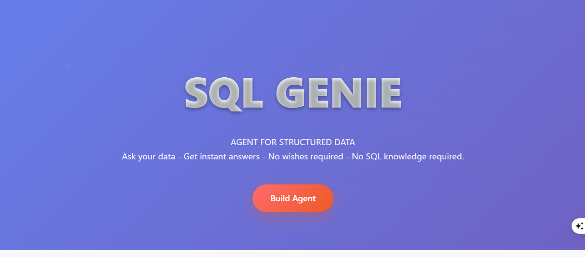
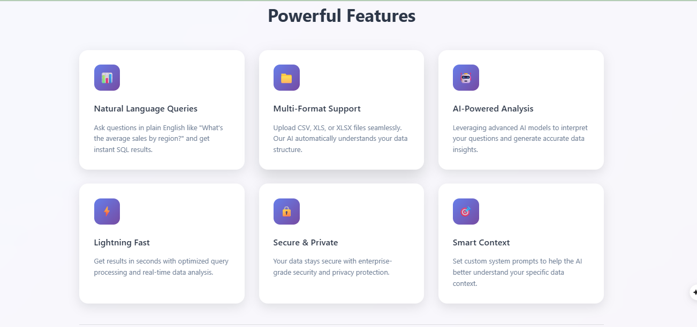
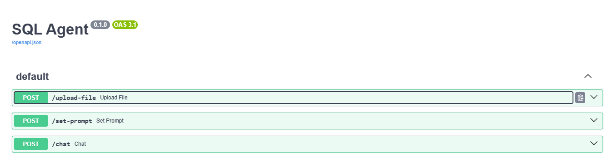
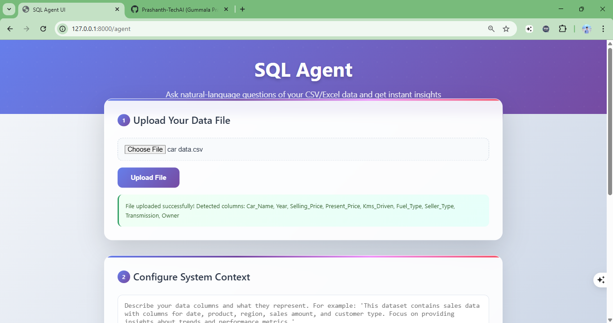
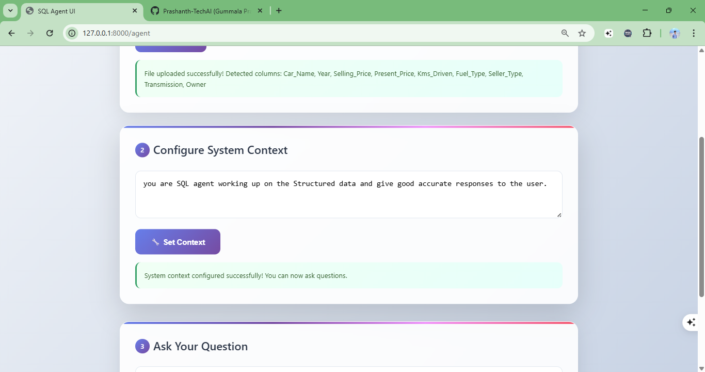
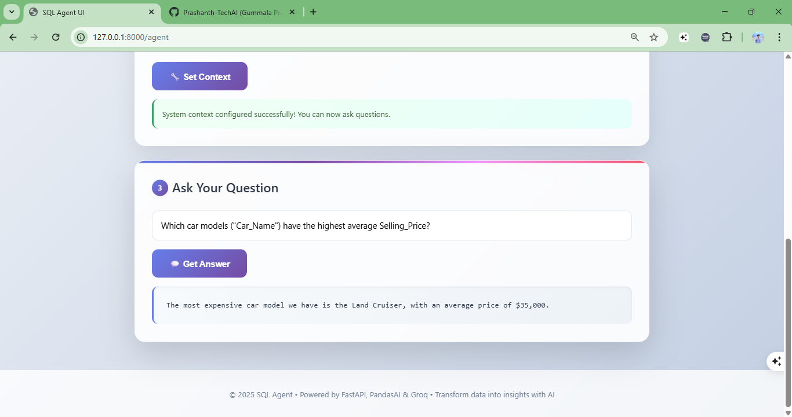
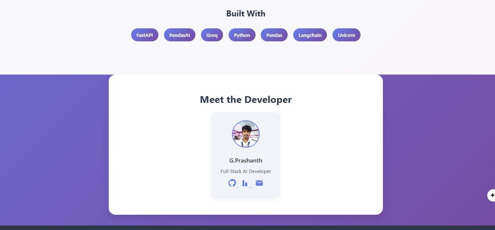

# 🧠 SQL Agent API (PandasAI + Groq + FastAPI)

A lightweight **SQL-like AI Agent** that answers natural language questions on **uploaded CSV or Excel files** using modern AI technologies.




## 🚀 Technologies Used

- 📊 **[PandasAI](https://github.com/gventuri/pandas-ai)** - Smart data analysis with natural language
- 🤖 **[LangChain + Groq (LLaMA 3)](https://groq.com/)** - High-performance language model inference
- ⚡ **[FastAPI](https://fastapi.tiangolo.com/)** - Modern, fast web framework for building APIs
- 🐳 **Docker** - Containerized deployment ready

---

## ✨ Features


- 📁 **File Upload**: Support for `.csv` and `.xlsx` files
- 🔍 **Auto-Discovery**: Automatically extracts and displays column names
- 💬 **Natural Language Queries**: Ask questions in plain English
- 🎯 **Context-Aware**: Set system prompts to guide AI understanding
- 📊 **Human-Readable Results**: Get explanations, not just raw data
- 🚀 **Fast API**: RESTful endpoints with automatic documentation
- 🐳 **Docker Ready**: Easy deployment with containerization

---

## 🖼️ Screenshots

### API Documentation Interface


### File Upload Process


### Setting System Prompt


### Natural Language Query Example


---

## 📦 API Endpoints

### 1. `POST /upload-file`
Upload a CSV or Excel file to the system.

**Request:**
- Method: `POST`
- Content-Type: `multipart/form-data`
- Body: FormData with `file` field

**Response:**
```json
{
  "upload_id": "uuid-string",
  "columns": ["name", "age", "department", "salary", "join_date"]
}
```

**Example using cURL:**
```bash
curl -X POST "http://localhost:8000/upload-file" \
  -H "accept: application/json" \
  -H "Content-Type: multipart/form-data" \
  -F "file=@employees.csv"
```

---

### 2. `POST /set-prompt`
Set a system prompt to provide context about your dataset.

**Request:**
```json
{
  "upload_id": "uuid-string",
  "system_prompt": "The dataset contains employee data including name, salary, department, and join date. Focus on providing insights about employee demographics and compensation."
}
```

**Response:**
```json
{
  "message": "System prompt set successfully"
}
```

---

### 3. `POST /chat`
Ask natural language questions about your uploaded dataset.

**Request:**
```json
{
  "upload_id": "uuid-string",
  "query": "What is the average salary per department?"
}
```

**Response:**
```json
{
  "response": "Based on the employee dataset, here are the average salaries by department:\n\n• Engineering: $89,250 (highest paid department)\n• Sales: $65,400\n• Marketing: $58,750\n• HR: $55,200 (lowest average salary)\n\nThe Engineering department has the highest average compensation, which is typical for tech companies due to the specialized skills required."
}
```
### DEVELOPER DETAILS:


---

## 🛠️ Installation & Setup

### Prerequisites
- Python 3.8+
- pip package manager
- Groq API key ([Get one here](https://groq.com/))

### 1. Clone the Repository
```bash
git https://github.com/Prashanth-TechAI/SQL-GENIE
cd SQL-GENIE
```

### 2. Create Virtual Environment
```bash
python -m venv venv

# On Windows
venv\Scripts\activate

# On macOS/Linux
source venv/bin/activate
```

### 3. Install Dependencies
```bash
pip install -r requirements.txt
```

### 4. Environment Configuration
Create a `.env` file in the root directory:
```env
LLM_API_KEY=your-groq-api-key-here
```

### 5. Run the Application
```bash
uvicorn app.main:app --reload
```

The API will be available at:
- **API Base**: http://localhost:8000
- **Interactive Docs**: http://localhost:8000/docs
- **ReDoc**: http://localhost:8000/redoc

---

## 🐳 Docker Deployment

### Option 1: Docker Build
```bash
# Build the image
docker build -t sql-agent-api .

# Run the container
docker run -p 8000:8000 -e LLM_API_KEY=your-groq-key sql-agent-api
```

### Option 2: Docker Compose
```bash
# Copy environment template
cp .env.example .env

# Edit .env and add your Groq API key
# Then run with compose
docker compose up -d
```

---

## 📁 Project Structure

```
sql_agent_api/
├── app/
│   ├── __init__.py
│   ├── main.py              # FastAPI application and endpoints
│   ├── store.py             # In-memory storage for uploads and prompts
│   ├── llm_client.py        # Groq LLM client configuration
│   └── llm_utils.py         # PandasAI response processing utilities
├── images/                  # Screenshots and documentation images
│   ├── banner.png
│   ├── fastapi-docs.png
│   ├── file-upload.png
│   ├── system-prompt.png
│   ├── query-example.png
│   └── response-output.png
├── requirements.txt         # Python dependencies
├── Dockerfile              # Docker container configuration
├── docker-compose.yml      # Docker Compose setup
├── .env.example           # Environment variables template
├── .gitignore
└── README.md
```

---

## 🎯 Usage Examples

### Example 1: Employee Dataset Analysis
1. **Upload** your `employees.csv` file
2. **Set context**: "This dataset contains employee information including names, departments, salaries, and hire dates."
3. **Ask questions**:
   - "Who are the top 5 highest paid employees?"
   - "What's the gender distribution across departments?"
   - "How many people were hired each year?"

### Example 2: Sales Data Analysis
1. **Upload** your `sales_data.xlsx` file
2. **Set context**: "This is quarterly sales data with product categories, regions, and revenue figures."
3. **Ask questions**:
   - "Which region had the highest sales growth?"
   - "What are the top performing product categories?"
   - "Show me seasonal trends in our sales data"

---

## 🔧 Configuration

### Environment Variables
| Variable | Description | Required |
|----------|-------------|----------|
| `LLM_API_KEY` | Your Groq API key | Yes |
| `DEBUG` | Enable debug mode | No (default: False) |
| `MAX_FILE_SIZE` | Maximum upload file size | No (default: 10MB) |

### Supported File Formats
- **CSV files** (`.csv`) - Comma-separated values
- **Excel files** (`.xlsx`, `.xls`) - Microsoft Excel formats

---

## 🤝 Contributing

1. Fork the repository
2. Create a feature branch (`git checkout -b feature/amazing-feature`)
3. Commit your changes (`git commit -m 'Add amazing feature'`)
4. Push to the branch (`git push origin feature/amazing-feature`)
5. Open a Pull Request

---

## 📝 License

This project is licensed under the MIT License - see the [LICENSE](LICENSE) file for details.

---

## 🐛 Troubleshooting

### Common Issues

**1. "API Key not found" error**
- Make sure your `.env` file contains `LLM_API_KEY=your-actual-key`
- Verify the API key is valid and has sufficient credits

**2. File upload fails**
- Check file size (must be under 10MB by default)
- Ensure file format is supported (CSV or Excel)
- Verify file is not corrupted

**3. Queries return empty responses**
- Try setting a more descriptive system prompt
- Make sure your question relates to the uploaded data
- Check if the dataset has the columns you're asking about

### Getting Help

- 📖 Check the [FastAPI documentation](http://localhost:8000/docs) when running locally
- 🐛 Report bugs via [GitHub Issues](https://github.com/your-username/sql-agent-api/issues)
- 💬 Join our community discussions

---

## 🙏 Acknowledgments

- [PandasAI](https://github.com/gventuri/pandas-ai) for the intelligent data analysis capabilities
- [Groq](https://groq.com/) for lightning-fast LLM inference
- [FastAPI](https://fastapi.tiangolo.com/) for the excellent web framework
- The open-source community for making this project possible

---

<div align="center">
  <strong>⭐ If this project helped you, please give it a star! ⭐</strong>
</div>